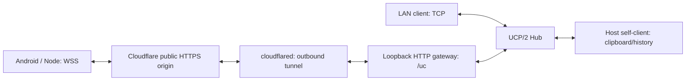

# Universal Clipboard 0.5.0 — Local + Internet / Cloudflare Tunnel

เอกสารส่งต่อสำหรับผู้ใช้และ agent อีกตัว — 9 ตุลาคม 2026

## สิ่งที่ทำแล้ว

Host เลือก Local only หรือ Local + Internet ได้ Desktop Node และ Android เชื่อม Internet ผ่าน HTTPS origin / binary WebSocket (`wss://…/uc`) โดยใช้ UCP/2 framing, authentication, AES-256-GCM, chunk ACK, SHA-256 และ resume เดิม งาน history 5 รายการ, batch และ auto-files ที่อยู่ในโปรเจกต์ตอนเริ่มถูกเก็บไว้ ไม่ได้เขียนแทนใหม่

ระบบนี้ใช้ Cloudflare Quick Tunnel เป็นช่องทางผ่าน Internet สำหรับ demo ไม่ใช่ VPN และยังไม่ได้ทำ Named Tunnel, domain ถาวร, iOS หรือเว็บ client

## เริ่มใช้งาน

Node.js 22+; ติดตั้งแพ็กเกจจากไฟล์ `.tgz` ที่ส่งมอบ หรือรันซอร์สหลัง `npm ci`

```powershell
npm install -g ./universal-clipboard-lan-0.5.0.tgz

# LAN เท่านั้น (default ของ uc host)
uc host --local-only

# LAN + Internet
uc host --internet

# เปิดตาม settings เดิม รวมโหมด Internet ที่บันทึกไว้
uc start
```

`uc setup` แบบ interactive มีคำถามเลือก local only / local + Internet เมื่อสร้าง Host เครื่องหนึ่งใช้ profile/service เดียว หยุด terminal เดิมก่อนเปลี่ยน role หรือโหมด

ครั้งแรก Internet mode ดาวน์โหลด binary `cloudflared` ทางการลง profile `tools/2026.10.0/` ตรวจ SHA-256 ที่ pin ไว้ แล้วเปิดเป็น child process แบบไม่มี shell/หน้าต่าง ไม่ต้องลง VPN ฝั่ง client อัตโนมัติรองรับ Windows x64 และ Linux x64/arm64; platform อื่นจะแจ้งข้อจำกัด ข้อมูลรับส่งยังไม่เปิดเผยเมื่อผู้ใช้กรอก URL อย่างเดียว

LAN/control พร้อมก่อน tunnel download/startup ถ้า Internet เปิดไม่สำเร็จ LAN ยังทำงาน ตรวจ `uc status` และเริ่ม Host ใหม่เพื่อ retry การเริ่มต้นที่ล้มเหลว ถ้า connector ที่เริ่มแล้วออกระหว่างทำงาน จะลองเปิดใหม่และพิมพ์ URL ใหม่

## จับคู่ workstation

Host แสดง LAN QR และเมื่อ tunnel พร้อมจะแสดง Internet QR พร้อมคำสั่งเต็มสำหรับ CLI อีกเครื่อง ขอคำเชิญใหม่ได้ด้วย:

```powershell
uc qr --internet
```

Copy คำสั่ง `uc join "uvc://join?..."` ที่ Host แสดงไปรันอีก workstation อย่าพิมพ์ `…` ตามตัวอย่าง ต้องใช้ลิงก์เต็มที่มีรหัสสุ่มจริง คำเชิญใช้ได้ 2 นาทีสำหรับอุปกรณ์ใหม่หนึ่งตัว CLI บันทึก credential เฉพาะเครื่อง แล้วเริ่ม sync

ครั้งต่อไป `uc start` ใช้ credential เดิม หาก Quick Tunnel เปลี่ยน URL หยุด client terminal เดิม แล้วอัปเดตที่อยู่โดยรักษา credential/ตัวตน Host:

```powershell
uc join "https://NEW-HOST.trycloudflare.com"
```

คำสั่ง URL เปล่าใช้ได้เฉพาะ profile ที่จับคู่สำเร็จแล้วและไม่มี invitation ค้าง หากเป็นเครื่องใหม่ต้องใช้คำเชิญ ห้ามส่งต่อคำเชิญให้บุคคลที่ไม่ต้องการให้เข้ากลุ่ม หลีกเลี่ยงการเก็บ terminal history ที่มี secret บนเครื่องร่วมใช้

## จับคู่ Android

ติดตั้ง APK 0.5.0 → Scan QR (หรือใช้เมนูวางคำเชิญในหน้าสแกน) → ตรวจ Host HTTPS URL / ชื่อมือถือ → Join Host ตาม flow เดิม การอนุญาต notification ยังคงจำเป็นสำหรับ SEND/STOP

ช่อง Host เปลี่ยนเป็น **Host IP / HTTPS URL**. LAN ยังใช้ IP/port/PIN; Internet ใช้คำเชิญหรือ credential ที่จับคู่ไว้เท่านั้น ไม่อนุญาต PIN กลุ่มผ่าน public endpoint หาก URL เปลี่ยน กรอก URL ใหม่โดยเว้น PIN และใช้ credential เดิม แอปตรวจ hubId ที่คาดไว้ก่อนยืนยัน session ไม่เชื่อม Host คนละตัวเงียบ ๆ

SEND, minimum one-second progress, STOP, generic incoming files, history และ content URI ทำงานตาม baseline เดิม รายการส่งที่ค้างจาก URL เก่ายังยึด destination เดิมใน job; APK ยังไม่มี migration UI สำหรับเปลี่ยน endpoint ของ pending job ให้ส่งรายการนั้นเสร็จก่อนเปลี่ยน URL หรือผู้ใช้เลือก clear pending job ตาม UI เดิมอย่างชัดเจน อย่าเปลี่ยน identity/job destination อัตโนมัติ

**Signing:** APK ที่ส่งมอบเซ็นด้วย key ใหม่ในสำเนา build แยก ไม่ได้อ่าน/คัดลอก signing key เดิมของโปรเจกต์ จึงอาจอัปเดตทับ APK เดิมไม่ได้ แม้ versionCode เพิ่มเป็น 7. ไม่ได้ถอนติดตั้งแอปบนมือถือจริง Agent ที่จะสร้าง APK ให้ update-compatible ต้องได้รับอนุญาตใช้ key เดิมก่อน ไม่คัดลอก private key เข้ารายงานหรือ Git

## Architecture



HTTPS URL เป็นที่อยู่; invitation เป็นสิทธิ์เพิ่มอุปกรณ์; session คือ key ใหม่สำหรับ connection แต่ละครั้ง Public gateway ไม่ใช่ local CLI control API และไม่มี web upload/form

Gateway bind เฉพาะ `127.0.0.1` และ port สุ่ม เปิดเฉพาะ WebSocket upgrade `/uc`. UCP ต้องเป็น binary frames ขนาดจำกัด ปิด compression มี inactivity timeout/heartbeat และ connection ceiling เดิม Public auth ปฏิเสธ group PIN ของอุปกรณ์ใหม่ ต้องมี invitation secret หรือ saved per-device authKey. QR กลุ่ม LAN รุ่น v1 ยังใช้ได้ รุ่น v2 มี `url` แทน `host/port`; protocol session ยังเป็น `ucp/2`

TLS ตรวจ certificate/hostname ตามระบบ ไม่ใช้ trust-all. Android implements RFC 6455 client สำหรับ binary frames, client masking, ping/pong, fragmentation และ bounded headers/frame sizes; UCP decoder เดิมยังรับผิดชอบ framing. Node ใช้ ws 8.22.0

Hub เป็นผู้ยุติ UCP session และ forward ข้อมูลเหมือน baseline: การเข้ารหัสระดับแอปนี้เป็น client↔Hub ไม่ใช่ peer↔peer end-to-end ที่ปิดข้อมูลจาก Host. Cloudflare ยุติ TLS ที่ edge แต่ยังเห็นเฉพาะ UCP secure envelopes หลัง auth; handshake มี ID/name/proof ไม่ควรอ้างว่า metadata ทั้งหมดซ่อนจากผู้ให้บริการ

## ไฟล์ที่แก้ / เพิ่ม

- `src/internet.js`: URL normalization, WSS client adapter, loopback public gateway, socket lifecycle/timeout
- `src/tunnel.js`: pinned official download/checksum, bounded connector logs, Quick Tunnel startup/restart/owned-child shutdown
- `src/hub.js`: invitation-only / per-device credential gate สำหรับ public transport
- `src/client.js`: เลือก TCP หรือ WSS; logic receive/send/history/batch เดิม
- `src/pairing.js`: v1/v2 invite serialization/validation
- `src/service.js`: async Internet lifecycle, status, Internet QR, ปิด gateway/connector เมื่อหยุด
- `src/cli.js`: flags/setup/QR/CLI invite/saved endpoint update
- Android `WebSocketTransport.java`, `Wire.java`, `Invitation.java`, `Config.java`, `MainActivity.java`, manifest
- `test/internet.test.js`: Internet auth/transfer/resume/revoke/connector lifecycle
- `scripts/internet-smoke.mjs`, Android `test/InternetSmoke.java` และ test manifest: live interop fixtures
- `scripts/run-tests.mjs`: รัน tests โดยเก็บ payload ชั่วคราวใน OS temp นอก OneDrive แต่ import ซอร์สจริงจาก checkout; แก้การรันทดสอบที่ถูก OneDrive ล็อก atomic rename ไม่ได้เปลี่ยน storage behavior จริง
- package/version/lockfile และคู่มือที่ลิงก์เอกสารนี้

## ผลตรวจสอบ

- Node **38/38 tests ผ่าน** รวม tests history/batch เดิมและ Internet transport ใหม่
- `npm audit` หลัง pin ws: ไม่พบช่องโหว่ ณ วันทดสอบ
- Service/control live smoke ผ่าน: LAN/control พร้อมระหว่าง tunnel startup, connector จริง, Internet QR ผ่าน authenticated local control และ clean shutdown
- APK compile / signature scheme v3 verify ผ่าน
- Cloudflare Quick Tunnel จริง: Node WSS upload/download ข้อความ และ random binary 200,123 bytes ตรวจ SHA-256 ตรงทั้งสองทิศทาง
- Android emulator ผ่าน Cloudflare จริง: **15 PASS** รวม TLS/WSS pairing, encrypted ping, text upload, binary upload 140,123 bytes, Host text/file receive, URI content hash, credential reconnect และ wrong-host rejection
- Android history emulator: **27 PASS** รวม FIFO/batch/clipboard URI grants/permanent Downloads export/storage pressure/restart
- LAN Android regression ผ่าน: PIN/QR confirm, focused clipboard capture, SEND ≥1 วินาที, image/file upload, background receive, URI grants, generic two-file batch และ resume. Fresh-install test ต้อง grant notification permission ก่อนกด Join ตาม fixture
- ยังไม่ได้ทดสอบ Nothing Phone 3a จริง, Linux จริง หรือ Wi-Fi Host + มือถือ 5G จริง Emulator/Node ใช้ Internet endpoint จริงแต่ใช้ uplink ของเครื่องทดสอบเดียวกัน

พบ Quick Tunnel DNS propagation ช้าระหว่างทดสอบ: DNS เครื่องตอบ NXDOMAIN ตอนต้น แต่ต่อมา resolve ได้และการทดสอบจริงผ่าน ไม่มีการปิด TLS verification หรือแก้ DNS/hosts ของเครื่องเพื่อหลบปัญหา ถ้าเชื่อมทันทีไม่ได้ รอแล้วขอ invitation ใหม่; ไม่ให้คำเชิญหมดอายุก่อน endpoint พร้อม

## ข้อจำกัดและงานต่อ

- Quick Tunnel URL เปลี่ยนทุกครั้งที่สร้างใหม่ ไม่มี uptime guarantee; ใช้สำหรับ demo/dev. Named Tunnel/domain ถาวรยังไม่ทำ
- ผู้ใช้ต้องรับ URL ใหม่ถ้า connector restart สร้าง Quick Tunnel ใหม่; credentials เดิมใช้ได้กับ Host เดิม
- Internet mode ไม่รับประกันว่าข้าม firewall/DNS restrictions ทุกเครือข่าย
- Android pending transfer destination migration และ named tunnel configuration เป็นงานต่อ ไม่แก้ job เดิมอัตโนมัติ
- Cloudflared release pin ต้องอัปเดต version/checksums แบบตั้งใจ ไม่ auto-run fetched scripts หรือ auto-update binary โดยไม่ตรวจ
- การใช้งาน public endpoint ต้องรักษา invitation/credential; ไม่อ้างว่า knowledge of URL ให้สิทธิ์อ่าน clipboard

## วิธีทดสอบข้ามเครือข่ายบนอุปกรณ์จริง

1. Host ต่อ Wi-Fi บ้าน เปิด `uc host --internet` และรอ URL พร้อม
2. มือถือปิด Wi-Fi ใช้ 4G/5G สแกน Internet QR ใหม่ แล้ว Join
3. ทดสอบ text/image/generic file สองทิศทางตาม receiver capabilities และตรวจ history/URI/ไฟล์จริง
4. ตัดเน็ตระหว่างไฟล์ใหญ่แล้วเปิดใหม่ ตรวจ resume จาก nonzero ACK offset
5. ทดลองเครื่องใหม่ใช้ URL/PIN อย่างเดียว ต้องถูกปฏิเสธ; revoke อุปกรณ์ที่จับคู่แล้วต้องเชื่อมไม่ได้
6. Ctrl+C Host → child connector และ gateway หยุด; LAN mode ไม่สร้าง public endpoint

## ให้ agent อีกตัวอ่าน

อ่านเอกสารนี้และ `CLIPBOARD-HISTORY-HANDOFF.md` ก่อนแก้ โปรดตรวจ source ปัจจุบันและอย่า revert history/batch/auto-files. ทำงานใน repo `universal-clipboard/` และ canonical `android/`; `android_demo_apk/` เป็น snapshot เก่า คุยเรื่อง signing key ก่อน build สำหรับอัปเดตมือถือเดิม ผล emulator ไม่เท่ากับ physical-device verification

อ้างอิงทางการ:
- https://developers.cloudflare.com/tunnel/get-started/quick-tunnels/
- https://developers.cloudflare.com/cloudflare-one/networks/connectors/cloudflare-tunnel/routing-to-tunnel/protocols/
- https://developers.cloudflare.com/network/websockets/
- https://github.com/cloudflare/cloudflared/releases/tag/2026.10.0
